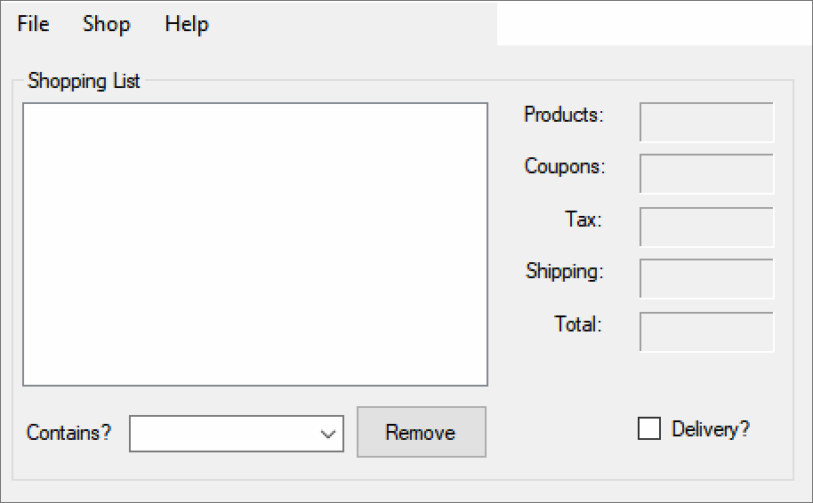

# Grocery Checkout Application built using VB.NET syntax.
# Purpose: Create Store application to buy products and add coupons.

The sales tax is 6%. If the delivery checkbox is checked, for each PRODUCT item the shipping rate is $2.00, otherwise if not checked the shipping rate is $0. Global variables for price of the currently selected item and name of the currently selected item.

    Names and prices of the available PRODUCTS:
      - Bread (PRODUCT) is $3.95
      - Milk (PRODUCT) is $4.50
      - Sugar (PRODUCT) is $2.50
      - Coffee (PRODUCT) is $4.95
      
    Names and credit of the available COUPONS:
      - Milk (COUPON) is -$0.75
      - Sugar (COUPON) is -$0.55
      - Coffee (COUPON) is -$1.85
    
**ShoppingList Form logic:**
  1.	File/Reset will clear the Product List.
  2.	File/Exit will close the Application.
  3.	Shop/Products will open the Product form.
  4.	Shop/Coupons will open the Coupon form.
  5.	Help/About will display a messagebox with application name and version.
  6.	When Form _Activated event, if item selected, add to Product List and perform calculations as follows:
      Products() = Sum of each Product, List item * Product cost
      Coupons() = Sum of each Coupon, List item * Coupon credit
      SalesTax() = SubtotalBuy() * TaxRate
      Shipping() = If delivery checked, Count of List Items * ShippingRate
      Total() = SubtotalSell() + SubtotalBuy() + SalesTax() + Shipping()
  7.	Remove Button on Click should remove the selected item from the Product List, then call Procedure(s) using Loop(s), constants and variables to update subtotal, tax, shipping and total display formatted as currency.
  8.	Contains? Combobox on _SelectedIndexChanged event, will loop through Product List Items to determine if list contains ComboBox.Text, then show message to display either Contains or Does Not Contain.  
  
**Products Form logic:**
  1.	Add Button on Click should store the selected item name and price in global variables and close Form.
  2.	Close Button on Click should close Form.
  
  ## Video Walkthrough

Here's a walkthrough of the app:

GIF created with [LiceCap](http://www.cockos.com/licecap/).

