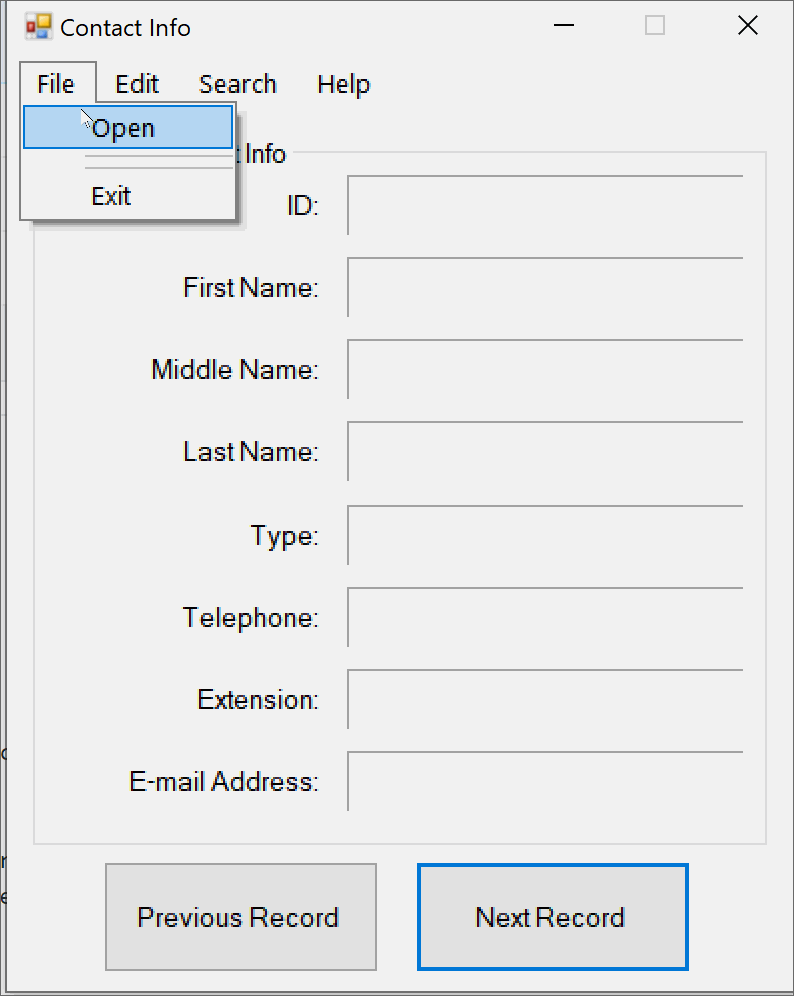

# Contact Info Application.
# Purpose: Store Contact Info within Database.

**DisplayContactInfo Form logic:**
  * The Contact Info will be initially empty, but on Open will display the first Contact record from the Contact table.
  * The Open Button on click should instantiate data object in the data layer, which will open the database using ADO.NET and TableAdapter, then set screen values based on the Datasource.
  * The Next Record should display the next data record.
  * The Previous Record should display the previous data record.
  * The Exit Button on click will close the database and end the application.
 
**EnterContactInfo Form logic:**
  *The Contact Info will be initially empty, except ComboBox, which should be loaded with specified values.
  * The user should be able to enter all data values based on data types.
  * Save Button on Click should add all values to the Contact, then clear the values from TextBoxes.
  * Clear Button on Click should clear all values from the TextBoxes.
  * Close Button on Click should close/hide form without saving data.
  
  ## Video Walkthrough

Here's a walkthrough of the app:

GIF created with [LiceCap](http://www.cockos.com/licecap/).
